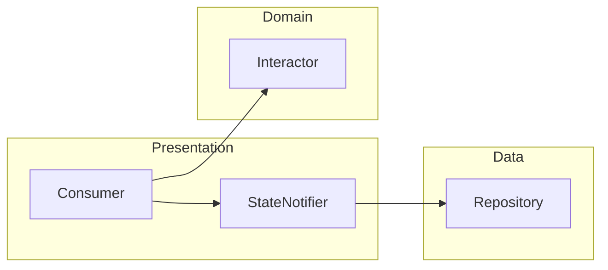
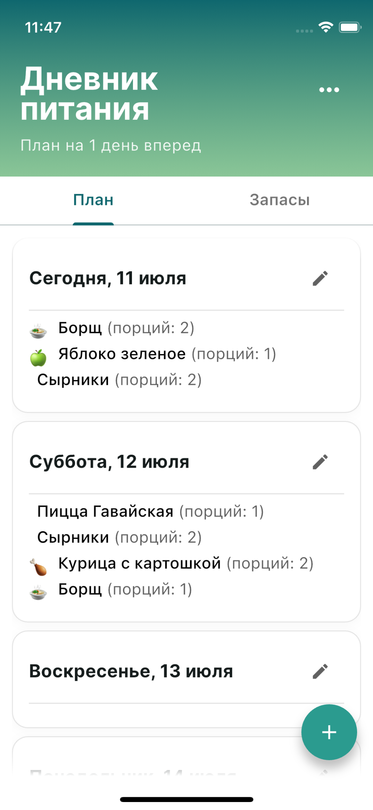
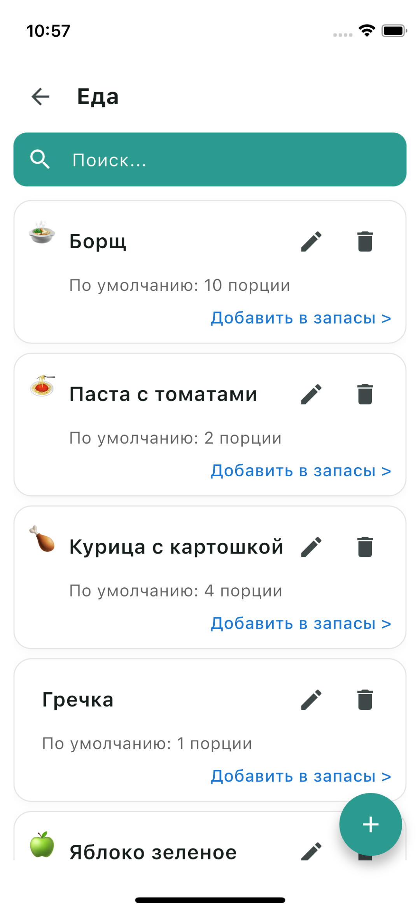
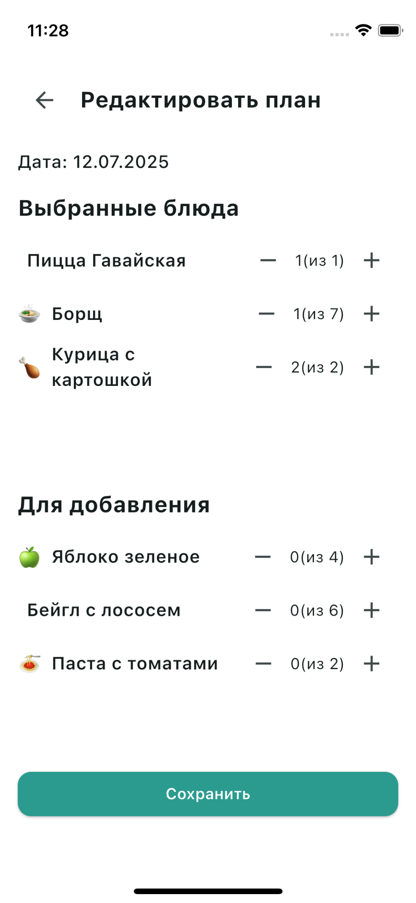
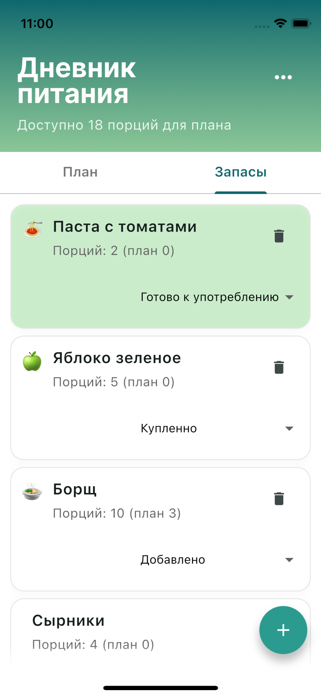

# 🍽️ Food Planner - Flutter State Management Demo

> **Демонстрация профессиональной архитектуры Flutter-приложения с Riverpod**

[](https://flutter.dev/)
[](https://riverpod.dev/)
[](https://hivedb.dev/)
[](#архитектура)

📱 **Мобильное приложение** для планирования питания по методу `batch cooking`
---

## 🎯 Техническая витрина
- **💾 Local-First Architecture** - Hive c автогенерацией
- **🔄 Reactive State Management** - Layered Architecture c Riverpod



---

## 🚀 Функциональность
- ✅ **Управление заготовками** - CRUD операции с валидацией
- ✅ **Планирование питания на день** - скрол дней с отображением запланированного питания
- ✅ **Управление запасами** - скрол карточек запасов со статусом и количеством доступных заготовок 
- ✅ **Статистика в реальном времени** - количество распланированных дней на будущем и незапланированных порций еды

---

## 🏗️ Структура проекта

```
lib/
├── 📁 core/                   # Общая функциональность
│   ├── extensions/            # DateTime, String extensions
│   ├── navigation/            # AppRoutes
│   └── logger.dart            # Логирование
│   └── app_initializer.dart   # Инициализация Hive
├── 📁 models/                 # Бизнес-модели
│   ├── dish_template/     
│   ├── dish_stock/        
│   └── daily_plan/        
├── 📁 providers/              # State Management
│   ├── dish_template/         # Template logic
│   │   ├── notifier.dart      # StateNotifier
│   │   ├── interactor.dart    # Business logic
│   │   └── repository.dart    # Data access
│   │   └── providers.dart     # Providers
│   ├── dish_stock/           # Stock logic
│   └── daily_plan/           # Planning logic
│   └── core_providers/       # Core logic
├── 📁 screens/               # UI экраны
│   ├── startup_screen.dart   # Инициализация
│   ├── dish_template/        # Управление блюдами
│   └── daily_plan/           # Планирование
├── 📁 utils/
└── 📁 widgets/               # Переиспользуемые компоненты
    ├── common_header.dart
    └── styled_button.dart
    └── ...
```

---

## 🛠️ Технический стек

### Core
- **Flutter 3.16+** - Cross-platform UI framework
- **Dart 3.2+** - Language features: records, patterns, sealed classes

### State Management
- **Riverpod 2.4+** - Reactive state management
- **StateNotifier** - Immutable state updates
- **Provider Pattern** - Dependency injection

### Data & Persistence
- **Hive 4.0+** - Fast NoSQL database
- **Freezed 2.4+** - Immutable data classes
- **JSON Annotation** - Serialization

### UI & UX
- **Material Design 3** - Modern design system
- **Google Fonts** - Typography
- **Custom Animations** - Smooth transitions

---

## 🚀 Установка и запуск

### Требования
- Flutter 3.16+
- Dart 3.2+

### Быстрый старт
```bash
# Клонирование
git clone https://github.com/username/food_planner.git
cd food_planner

# Установка зависимостей
flutter pub get

# Генерация кода (Freezed, Hive adapters)
flutter packages pub run build_runner build

# Запуск
flutter run
```

### Build & Release
```bash
# Android APK
flutter build apk --release

# iOS IPA  
flutter build ios --release

# Web
flutter build web --release
```
---

## 🤝 Контакты

**Надежда Седанова**
- 📧 Email: nad110508@gmail.com
- 💼 LinkedIn: [linkedin.com/in/nadezhda-sedanova](https://linkedin.com/in/nadezhda-sedanova)
- 🐱 GitHub: [github.com/nadezhda-sedanova](https://github.com/nadezhda-sedanova)

---

## 📸 Скриншоты

### Главный экран с статистикой


*Реактивная статистика автоматически обновляется при изменении данных*

### Список блюд с поиском


*Умный поиск и фильтрация по статусу наличия*

### Создание плана питания


*Интуитивный интерфейс планирования с date picker*

### Управление запасами


*Цветовое кодирование статусов и быстрое редактирование*

---
