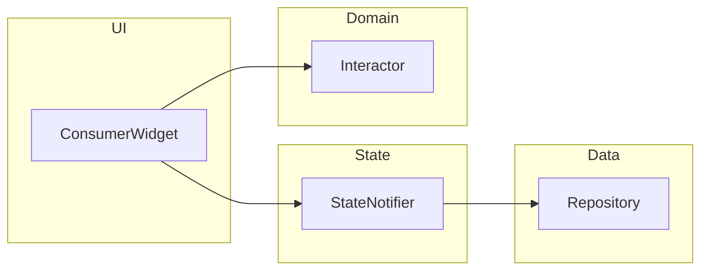

# 🍽️ Food Planner - мобильное приложение для планирования питания по методу `batch cooking`

> **Демонстрация профессиональной архитектуры Flutter-приложения с Riverpod**

[](https://flutter.dev/) 
[](https://dart.dev/) 
[](https://riverpod.dev/) 
[](#архитектура)
[](https://hivedb.dev/) 
[](https://firebase.google.com/docs/firestore)

---

## 🚀 Функциональность
- ✅ **Управление заготовками** - CRUD операции с валидацией
- ✅ **Планирование питания на день** - скрол дней с отображением запланированного питания
- ✅ **Управление запасами** - скрол карточек запасов со статусом и количеством доступных заготовок 
- ✅ **Статистика в реальном времени** - количество распланированных дней на будущем и незапланированных порций еды

---

## 🏗️ Структура проекта

```
lib/
├ core/
│  ├ extensions/
│  ├ navigation/
│  └ services/
│
├ models/
│  ├ daily_plan/
│  ├ dish_stock/
│  └ dish_template/
│
├ providers/
│  ├ shared/
│  ├ daily_plan/
│  ├ dish_stock/
│  └ dish_template/
│
├ screens/
│  ├ startup/
│  ├ templates/
│  ├ stock/
│  └ planning/
│
├ widgets/
└ utils/
```

---

## 🎯 Ключевые архитектурные решения
- **💾 Local-First Architecture** - Hive c автогенерацией
- **🔄 Reactive State Management** - Layered Architecture c Riverpod


- **ConsumerWidget** — подписывается на состояние и вызывает Interactors  
- **StateNotifier** — хранит UI‑state, инжектит Repository  
- **Interactor** — бизнес‑логика
- **Repository** — источник данных
---

## 🛠️ Технический стек

### Core
- **Flutter 3.16+** - Cross-platform UI framework
- **Dart 3.2+** - Language features: records, patterns, sealed classes

### State Management
- **Riverpod 2.4+** - Reactive state management
- **StateNotifier** - Immutable state updates
- **Provider Pattern** - Dependency injection

### Data & Persistence
- **Hive 4.0+** - Fast NoSQL database
- **Cloud Firestore 5.6.11** – Remote NoSQL for recipe catalog and first‑launch sync

### Code Generation
- **build_runner  ^2.3.3**  - запускает все кодогенераторы  
- **hive_generator  ^2.0.1**  - генерирует адаптеры Hive
  
## 🚀 Установка и запуск

### Требования
- Flutter 3.16+
- Dart 3.2+

### Быстрый старт
```bash
# Клонирование
git clone https://github.com/username/food_planner.git
cd food_planner

# Установка зависимостей
flutter pub get

# Генерация кода
flutter pub get \
  && flutter pub run build_runner build --delete-conflicting-outputs

# Запуск
flutter run
```

### Build & Release
```bash
# Android APK
flutter build apk --release

# iOS IPA  
flutter build ios --release

# Web
flutter build web --release
```
---

## 🤝 Контакты

**Надежда Седанова**
- 📧 Email: nad110508@gmail.com
- 💼 LinkedIn: [linkedin.com/in/nadezhda-sedanova](https://linkedin.com/in/nadezhda-sedanova)
- 🐱 GitHub: [github.com/nadezhda-sedanova](https://github.com/nadezhda-sedanova)

---

## 📸 Скриншоты


*Реактивная статистика автоматически обновляется при изменении данных*


*Умный поиск и фильтрация по статусу наличия*


*Интуитивный интерфейс планирования с date picker*


*Цветовое кодирование статусов и быстрое редактирование*

---
